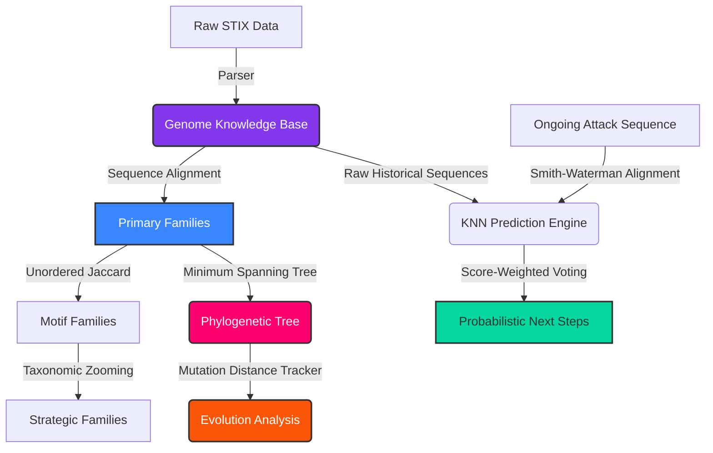

# CyberPhylogeny: A Bio-Inspired Framework for Reconstructing Evolutionary Relationships of Cyberattacks

[](https://www.python.org/downloads/)
[]()
[]()
[]()
[]()
[](https://opensource.org/licenses/MIT)

> **Research Concept:** CyberPhylogeny models cyberattacks as evolving behavioral genomes and reconstructs their evolutionary lineage using bioinformatics-inspired sequence analysis and phylogenetic inference.

## Research Hypotheses

This framework was built to explore the following open questions in proactive cyber defense:
* Can behavioral genomes accurately reconstruct the evolutionary ancestry of a cyberattack?
* Does sequence alignment clustering outperform traditional MITRE ATT&CK bag-of-words similarity?
* Can mathematical evolutionary distance improve ongoing attack prediction?
* Can quantifiable mutations (insertions/deletions/substitutions) identify how an attacker is adapting their tradecraft?

## The Biological Mapping

CyberPhylogeny maps standard cybersecurity ideas into a 4-tier biological ontology. To make a "gene" computationally meaningful rather than just a metadata tag, we define it by its function, inputs, and outputs:

- **Gene:** A specific, atomic computational operation in an attack sequence.
  ```text
  Identifier                  → G17
  Semantic Function (Tactic)  → Credential Access
  Preconditions               → Code Execution on Target
  Postconditions              → Extracted plaintext credentials/hashes
  Allowed Implementations     → LSASS Memory, NTDS.dit, DCSync
  ```
- **Genome:** The ordered sequence of Genes that makes up a complete cyberattack. While modern attacks may involve branching or retries, an individual **execution trace** (a specific instance of an attack) is a linear temporal path. The Genome models this trace.
- **Evolutionary Family:** A group of Genomes that share a common ancestor.
- **Phylogenetic Tree:** A branching graph constructed to infer the most likely evolutionary lineage. While computing true Maximum Parsimony is computationally intractable for large datasets, CyberPhylogeny utilizes **Minimum Spanning Trees (MST)** to build a parsimonious approximation by finding the shortest mutational paths connecting observed attack sequences.

## Formalization & Core Concepts

To elevate this framework beyond a heuristic analogy, we rely on formal mathematical definitions:

- **Genome (G)**: An ordered sequence of genes. `G = [g1, g2, g3, ..., gn]`
- **Evolutionary Distance (D(G1, G2))**: The mathematical distance between two genomes. Because cyberattack traces are modeled as discrete, ordered, temporal sequences, CyberPhylogeny utilizes **Weighted Sequence Alignment** with hierarchical taxonomic penalties. Graph Edit Distance captures topology but is less suited to our chosen execution-trace representation, which preserves strict temporal order. Sequence alignment is conceptually aligned with biological methods while remaining computationally tractable for our threat model.
- **Local Alignment**: Using the Smith-Waterman algorithm to mathematically discover optimal local subsequence alignments. This identifies the most similar historical subsequences, which are then used by the KNN engine for prediction.
- **Mutation (Δ(G1, G2))**: The specific genetic changes (Insertions, Deletions, Substitutions) that turn `G1` into `G2`.
- **Family (F)**: A density-based cluster of genomes where the distance `D` is less than a threshold `ϵ`. `F = { G | D(G1, G2) < ϵ }`

## The Novel Contribution: Beyond Pattern Matching

Why model attacks as evolving genomes instead of simply comparing ATT&CK sequences? Standard Threat Intelligence tools fail when faced with polymorphism because they treat a substitution of `PowerShell` to `Python` as a 100% miss. CyberPhylogeny introduces a new approach by shifting focus from **similarity** to **ancestry**:

1. **From Similarity to Lineage Inference:** Traditional systems compare two lists of techniques and give a static similarity score (e.g., "85% match"). CyberPhylogeny's true novelty is reconstructing *ancestry*. It infers the most parsimonious lineage, estimating how an attack evolved and identifying the exact branch where it mutated.
2. **Biological Abstraction:** By treating techniques as computational Genes, CyberPhylogeny mathematically tracks tactical mutations preserving the same underlying function, abstracting away polymorphic noise.
3. **Maximum Parsimony vs. Chronology:** Real evolution is driven by accumulating mutations, not just the passage of time. CyberPhylogeny uses chronological timestamps only as a *directional constraint* (a descendant cannot predate its ancestor) while relying on **Maximum Parsimony** (MST) to determine the actual evolutionary lineage.
4. **Predictive Alignment:** CTI tools are typically reactive. CyberPhylogeny utilizes local sequence alignment (Smith-Waterman) to accurately align ongoing, incomplete attack sequences against historical genomes. These alignments identify the most similar historical subsequences, which then feed our KNN engine to probabilistically estimate the next move.
5. **Algorithmic Scalability:** Features a custom **MinHash LSH** pass to instantly filter and bucket genomes before running the heavy comparison math, making the framework extremely fast.

## Threat Model & Assumptions

To clarify what a "Genome" represents in this framework, we define the following scope:
- **Attack Scope**: We model linear *execution traces* of malware, tools, or specific APT campaigns.
- **Unified Genomic Space**: We cluster APT groups, malware, and open-source tools together into a single taxonomic tree. Modern APT campaigns frequently subsume and evolve from commodity malware and open-source tools; tracing this evolutionary lineage requires a unified biological ontology.
- **The Genome**: Represents a temporal, ordered sequence of behaviors observed during a specific attack execution. It does not model a threat actor's entire arsenal or highly branching concurrent attacks.
- **Data Source**: We utilize MITRE ATT&CK STIX data, mapping techniques as the foundational genomic alphabet.

## Project Architecture (Multi-Stage Pipeline)



## Evaluation Metrics

To validate the framework's efficacy against traditional CTI, CyberPhylogeny utilizes the following evaluation framework:
* **Similarity Accuracy**: Benchmarking Sequence Alignment vs raw Jaccard similarity.
* **Family Reconstruction Accuracy**: Validating cluster purity against ground truth datasets, including known MITRE ATT&CK Group overlaps and specific APT threat intelligence reports (e.g., isolating distinct APT29 evolutionary branches).
* **Prediction Accuracy**: Cross-validating the KNN prediction engine's ability to estimate the next gene in historical data despite active insertions/deletions.
* **Mutation Detection Accuracy**: Tracking how accurately substitutions identify polymorphic malware variants.
* **Phylogenetic Consistency**: Validating the Maximum Parsimony tree structure against temporal CTI reports.

## Installation & Usage

### Local Setup
1. **Clone the repository:**
   ```bash
   git clone https://github.com/rakesh-pathuri/CyberPhylogeny.git
   cd CyberPhylogeny
   ```
2. **Create a Virtual Environment:**
   ```bash
   python -m venv venv
   
   # Windows
   .\venv\Scripts\activate
   # macOS/Linux
   source venv/bin/activate
   ```
3. **Install Dependencies:**
   ```bash
   pip install rich scikit-learn numpy pydantic requests
   ```

### Command Line Interface & Examples

**1. Inspect an Attack Genome**
Pulls the complete genetic sequence of a specific attack.
```bash
python main.py genome S0697
```
*Example Output:*
```text
Loading cached ATT&CK Genome Repository...

Attack Genome : CSPY Downloader (S0527)

Execution
├── Scheduled Task
└── Malicious File

Privilege-Escalation
└── Bypass User Account Control

Command-And-Control
├── Web Protocols
└── Ingress Tool Transfer

Stealth
├── Software Packing
├── Masquerade Task or Service
├── Indicator Removal
├── File Deletion
└── System Checks

Defense-Impairment
├── Modify Registry
└── Code Signing

Genome Size : 12 Genes
Applying MinHash LSH pre-filtering...
Calculating distances (Weighted Sequence Alignment)... ━━━━━━━━━━━━━━━━━━━━━━━━━━━━━━━━━━━━━━━━ 100% 0:00:00
Mutation Index : 7.5
Family : 24
Generation : 3
```

**2. Multi-Stage Clustering** 
Groups attacks into families based on Sequence Alignment.
```bash
python main.py cluster --eps 0.45 --min_samples 2
```
*Example Output:*
```text
Loading cached ATT&CK Genome Repository...

--- STAGE 1: Sequence Alignment (Needleman-Wunsch) ---
Applying MinHash LSH pre-filtering...
Calculating distances (Weighted Sequence Alignment)... ━━━━━━━━━━━━━━━━━━━━━━━━━━━━━━━━━━━━━━━━ 100% 0:00:00

Genome Distance Statistics (997 genomes)
Min    : 0.00
Mean   : 0.96
Median : 1.00
95%    : 1.00
Max    : 1.00

STAGE 1: Evolutionary Ancestry (Weighted Sequence Alignment) Families

Family 0 - 166 attacks
+------------------------------------------------------+
| Attack /     |                       |               |
| Group ID     | Name                  | Genome Length |
|--------------+-----------------------+---------------|
| S0527        | CSPY Downloader       | 12            |
| S0347        | AuditCred             | 9             |
| S0263        | TYPEFRAME             | 5             |
| ...          | ...                   | ...           |
+------------------------------------------------------+

...

Clustering Summary
Attacks analyzed : 997
Families found   : 60
Largest family   : 166
Median family size: 2
Noise            : 645
Silhouette Score : 0.01
```

**3. Phylogenetic Terminal Tree (Topology)** 
Prints a clean mathematical dendrogram showing relationships and branch heights. Supports two algorithms:
- `mst` (Maximum Parsimony): Infers the most parsimonious ancestry between known attacks.
- `upgma` (Unweighted Pair Group Method with Arithmetic Mean): Generates a true hierarchical dendrogram with hypothetical common ancestors.
```bash
python main.py tree 24 --algo upgma
```
*Example Output:*
```text
Loading cached ATT&CK Genome Repository...
Applying MinHash LSH pre-filtering...
Calculating distances (Weighted Sequence Alignment)... ━━━━━━━━━━━━━━━━━━━━━━━━━━━━━━━━━━━━━━━━ 100% 0:00:00

Phylogenetic Tree for Family 24 (3 variants)
Algorithm: UPGMA
UPGMA Dendrogram (Root Height: 3.88)
├── ------------------- S0527 (CSPY Downloader) (branch: 3.88)
└── - Common Ancestor (height: 3.50, branch: 0.38)
    ├── ----------------- S0347 (AuditCred) (branch: 3.50)
    └── ----------------- S0263 (TYPEFRAME) (branch: 3.50)
```

**4. Mutation Diff (Forensic Report)**
Outputs a highly formatted, tactic-grouped report showing exactly what was inserted, deleted, or substituted between two attacks (just like `git diff`).
```bash
python main.py diff S0347 S0527
```
*Example Output:*
```diff
Loading cached ATT&CK Genome Repository...

Attack : S0527 (CSPY Downloader)
Mutation Distance : 7.5

Mutations

[Execution]
  [~] Windows Command Shell -> Scheduled Task
+ [+] Malicious File (New Tactic Shift from persistence)

[Persistence]
- [-] Windows Service (Dropped Tactic Shift)

[Privilege-Escalation]
+ [+] Bypass User Account Control (New Tactic Shift from discovery)

[Discovery]
- [-] File and Directory Discovery (Dropped Tactic Shift)

[Command-And-Control]
  [~] Proxy -> Web Protocols

[Stealth]
  [~] Encrypted/Encoded File -> Software Packing
  [~] Process Injection -> Masquerade Task or Service
+ [+] Indicator Removal (New Gene)
  [~] Deobfuscate/Decode Files or Information -> System Checks

[Defense-Impairment]
+ [+] Modify Registry (New Gene)
+ [+] Code Signing (New Gene)
```

**5. Ancestry Trace**
Traces the evolutionary ancestry of a specific attack back to its root.
```bash
python main.py ancestry S0527
```
*Example Output:*
```text
Loading cached ATT&CK Genome Repository...
Applying MinHash LSH pre-filtering...
Calculating distances (Weighted Sequence Alignment)... ━━━━━━━━━━━━━━━━━━━━━━━━━━━━━━━━━━━━━━━━ 100% 0:00:00

Ancestry for S0527
S0263 (TYPEFRAME)
  | (distance = 7.00)
  v
S0347 (AuditCred)
  | (distance = 7.50)
  v
S0527 (CSPY Downloader)

* Ancestry inferred via Maximum Parsimony (Minimum Spanning Tree)
```

**6. Predict Next Steps** 
Estimates the attacker's most probable next behavioral gene.
```bash
python main.py predict T1566.001,T1059.001
```
*Example Output:*
```text
Ongoing Attack Sequence: ['T1566.001', 'T1059.001']

Most Probable Next Behaviors:
+-------------------------------------------------------------------------------------------------+
| Technique ID | Implementation        | Behavior              | Tactic    | Prob   | Confidence  |
|--------------+-----------------------+-----------------------+-----------+--------+-------------|
| T1059.003    | Windows Command Shell | Command and Scripting | execution | 33.3%  | 6.00x       |
| T1204.002    | Malicious File        | User Execution        | execution | 33.3%  | 6.00x       |
| T1059.005    | Visual Basic          | Command and Scripting | execution | 33.3%  | 6.00x       |
+-------------------------------------------------------------------------------------------------+
* Confidence Score represents the mathematical similarity of the historical sequence matched.
```

## Limitations & Future Work

To ensure scientific rigor, we acknowledge the following limitations of the framework:

1. **Inferred Provenance**: CyberPhylogeny reconstructs *inferred* behavioral ancestry rather than true, verified operational provenance. The inferred phylogeny is a hypothesis generated from behavioral similarity rather than verified attacker genealogy.
2. **Temporal Simplification**: The framework assumes attack traces can be represented as linear, ordered execution sequences, which may oversimplify highly parallel or distributed campaigns.
3. **Convergent Evolution vs. Shared Ancestry**: A critical challenge in both biology and cybersecurity is distinguishing *convergent evolution* (two independent threat actors discovering the same optimal technique sequence) from *shared ancestry* (code/tactic sharing). Future iterations of the prediction engine aim to incorporate geopolitical and attribution metadata to differentiate these phenomena.

---
### Authorship & Contributions
**Author:** Rakesh Pathuri

*This engine was architected and built independently by Rakesh Pathuri inspired by biological sequence analysis and an attempt to adapt it for proactive cyber defense.*
