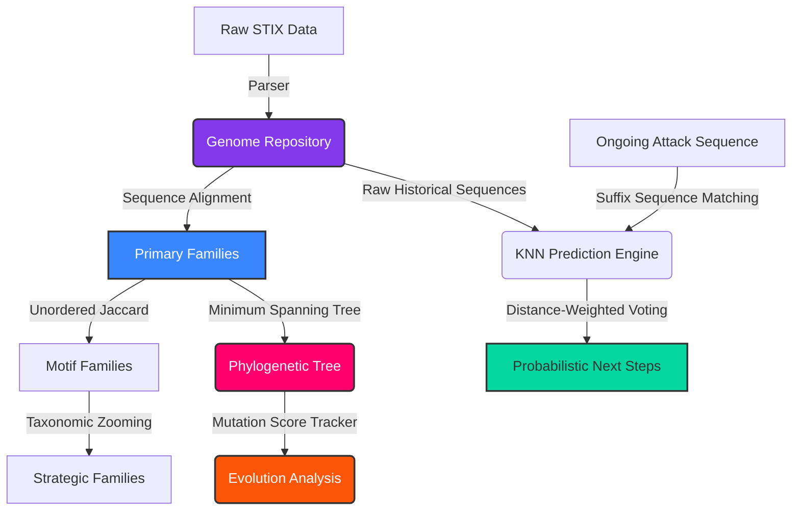

# CyberPhylogeny: A Bio-Inspired Framework for Reconstructing Evolutionary Relationships of Cyberattacks

[](https://www.python.org/downloads/)
[]()
[]()
[](https://opensource.org/licenses/MIT)

> **Research Concept:** CyberPhylogeny models cyberattacks as evolving behavioral genomes and reconstructs their evolutionary lineage using bioinformatics-inspired sequence analysis and phylogenetic inference.

## The Biological Mapping

CyberPhylogeny maps standard cybersecurity ideas into biology:

- **Gene:** A single action in an attack. It has 3 parts:
  ```text
  Behavior (e.g., Credential Access)
      ↓
  Implementation (e.g., OS Credential Dumping)
      ↓
  MITRE Technique (e.g., T1003)
  ```
- **Genome:** The ordered sequence of Genes that makes up a complete cyberattack.
- **Evolutionary Family:** A group of Genomes that share a common ancestor.
- **Phylogenetic Tree:** A branching tree showing exactly how a new attack evolved from an older one.

## Mathematical Definitions

This research framework relies on formal definitions to model attacks:

* **Genome ($G$)**: An ordered sequence of genes. $G = [g_1, g_2, g_3, \dots, g_n]$
* **Distance ($D(G_1, G_2)$)**: The mathematical distance between two genomes using Sequence Alignment (Needleman-Wunsch).
* **Mutation ($\Delta(G_1, G_2)$)**: The specific genetic changes (Insertions, Deletions, Substitutions) that turn $G_1$ into $G_2$.
* **Family ($F$)**: A density-based cluster of genomes where the distance $D$ is less than a threshold $\epsilon$. $F = Cluster(G)$

## The Novel Contribution: Beyond Pattern Matching

Standard Threat Intelligence tools use MITRE ATT&CK to describe what an attacker did. CyberPhylogeny introduces a new approach by shifting focus from **pattern matching** to **evolutionary reconstruction**:

1. **From Similarity to Ancestry:** Traditional systems compare two lists of techniques and give a simple score (e.g., "85% match"). CyberPhylogeny uses Minimum Spanning Trees (MST) to show *why* they are similar: *"Attack B evolved from Attack A, and here is the exact branch where it mutated."*
2. **Biological Abstraction:** Comparing raw MITRE IDs (like `T1059.001` vs `T1059.006`) treats them as completely different strings. By using the 3-part Gene hierarchy, CyberPhylogeny mathematically understands that changing PowerShell to Python is *not* a new attack—it is just a **mutation** of the same underlying "Execution" gene.
3. **Predictive Alignment vs. Reactive Detection:** CTI tools are reactive (they look at the past). CyberPhylogeny uses Sequence Alignment algorithms to probabilistically predict what an attacker *will do next*, based on the evolutionary history of their attack family.

## Project Architecture (Multi-Stage Pipeline)



## Installation & Usage

### Local Setup
1. **Clone the repository:**
   ```bash
   git clone https://github.com/rakesh-pathuri/CyberPhylogeny.git
   cd CyberPhylogeny
   ```
2. **Create a Virtual Environment:**
   ```bash
   python -m venv venv
   
   # Windows
   .\venv\Scripts\activate
   # macOS/Linux
   source venv/bin/activate
   ```
3. **Install Dependencies:**
   ```bash
   pip install rich scikit-learn numpy pydantic
   ```

### Command Line Interface & Examples

**1. Inspect an Attack Genome**
Pulls the complete genetic sequence of a specific attack.
```bash
python main.py genome S0697
```
*Example Output:*
```text
Genome Profile: HermeticWiper (S0697)
[HermeticWiper](https://attack.mitre.org/software/S0697) is a data wiper that 
has been used since at least early 2022, primarily against Ukraine...

Genetic Sequence (26 Genes)
+-----------------------------------------------------------------------------+
| Index | Technique ID    | Implementation               | Behavior           |
|-------+-----------------+------------------------------+--------------------|
| 1     | T1053.005       | Scheduled Task               | execution          |
| 2     | T1059.003       | Windows Command Shell        | execution          |
| 3     | T1106           | Native API                   | execution          |
| ...   | ...             | ...                          | ...                |
+-----------------------------------------------------------------------------+
```

**2. Multi-Stage Clustering** 
Groups attacks into families based on Sequence Alignment.
```bash
python main.py cluster --eps 0.6 --min_samples 2
```
*Example Output:*
```text
STAGE 1: Sequence Alignment (Needleman-Wunsch) Families

Family 24 - 5 attacks
+------------------------------------------------+
| Attack /     |                 |               |
| Group ID     | Name            | Genome Length |
|--------------+-----------------+---------------|
| S0390        | SQLRat          | 8             |
| S0360        | BONDUPDATER     | 7             |
| G0133        | Nomadic Octopus | 7             |
| G0079        | DarkHydrus      | 7             |
| G0084        | Gallmaker       | 6             |
+------------------------------------------------+
```

**3. Phylogenetic Terminal Tree (Core Feature)** 
Prints a branching evolutionary tree with Mutation Scores.
```bash
python main.py tree 24
```
*Example Output:*
```text
Phylogenetic Tree for Family 24 (2 variants)
Evolutionary Tree
├── Ancestor: S1135 (MultiLayer Wiper)
│   ├── execution: Scheduled Task
│   └── execution: Windows Command Shell
└── Descendant: S0697 (HermeticWiper) (Evolved from S1135)
    │   Mutation Score: 4.0
    ├── execution: Scheduled Task
    ├── execution: Windows Command Shell
    ├── Type: Insertion    | execution: Native API <-- New Gene
    ├── Type: Insertion    | persistence: Windows Service <-- New Gene
    ├── Type: Substitution | stealth: Compression <-- Mutated (from Stored Data Manipulation)
    └── defense-impairment: Clear Windows Event Logs
```

**4. Predict Next Steps** 
Predicts the attacker's next move based on Suffix Sequence Matching.
```bash
python main.py predict T1566.001,T1059.001
```
*Example Output:*
```text
Ongoing Attack Sequence: ['T1566.001', 'T1059.001']

Most Probable Next Behaviors:
+--------------------------------------------------------------------------------+
| Predicted Technique ID | Implementation        | Behavior  | Prob | Confidence |
|------------------------+-----------------------+-----------+------+------------|
| T1059.003              | Windows Command Shell | execution |  80% |      4.00x |
| T1059.007              | JavaScript            | execution |  20% |      1.00x |
+--------------------------------------------------------------------------------+
```

---
### Authorship & Contributions
**Author:** Rakesh Pathuri

*This engine was architected and built independently by Rakesh Pathuri inspired by biological sequence analysis and an attempt to adapt it for proactive cyber defense.*
