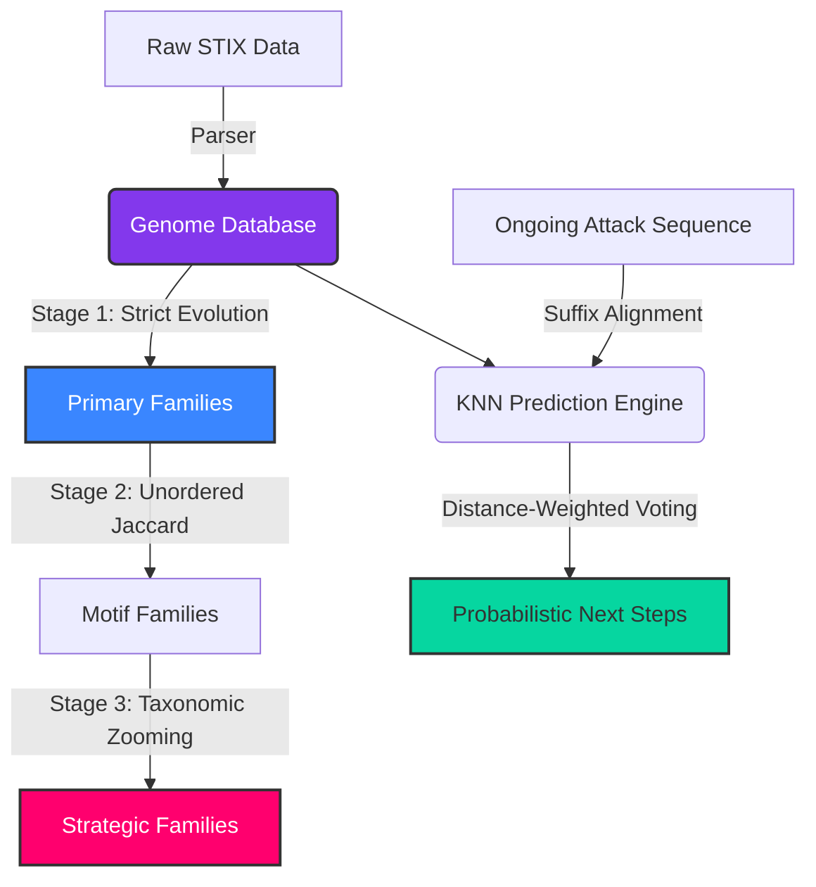

# CyberPhylogeny: Attack Genome Engine

[](https://www.python.org/downloads/)
[]()
[](https://opensource.org/licenses/MIT)

## Abstract
Traditional cybersecurity detection relies on rigid, signature-based indicators (IOCs). However, when threat actors slightly mutate their tools or techniques, these signatures fail. 

**CyberPhylogeny** introduces a biological approach to cyber defense. By extracting the fundamental behaviors (Techniques) of an attack and treating them as structural "DNA Genomes", this engine can mathematically align, cluster, and predict cyberattacks using algorithms originally designed for computational biology (like Levenshtein distance, Jaccard Similarity, and K-Nearest Neighbors). 

This allows the engine to accurately trace how malware mutates over time and probabilistically predict an attacker's next move, even if they intentionally deviate from historical patterns.

## Core Biological Concepts
The engine translates MITRE ATT&CK concepts into biological equivalents:
- **Gene**: A single, distinct behavior (e.g., `T1566.001 Spearphishing`).
- **Genome**: The complete, ordered sequence of genes representing an entire cyberattack campaign.
- **Family**: A mathematical cluster of Genomes (threat groups or malware) proven to share a common structural ancestor.
- **Mutation**: The insertion, deletion, or substitution of a specific gene across generations of an attack.

## Research Areas & Domains
This project sits at the intersection of computational biology, data science, and threat intelligence:
1. **Bioinformatics & Sequence Alignment**: Utilizing Global Levenshtein and Subsequence Alignment to calculate the structural distance between malware genomes.
2. **Unsupervised Machine Learning**: Deploying DBSCAN density-based clustering to automatically discover evolutionary families from raw behavioral data.
3. **Probabilistic Prediction (XDR/IDS)**: Utilizing Distance-Weighted K-Nearest Neighbors (KNN) to mathematically predict the highest probability next-steps of an ongoing attack.

## Project Architecture (Multi-Stage Pipeline)



## Core Features

- **Multi-Stage Classification Pipeline**: Handles complex "Orphan" attacks by filtering them through three biological lenses (Strict Sequence, Jaccard Bag-of-Genes, and Tactic-level Zooming).
- **V3 IDS/XDR Grade Prediction**: Uses sliding window suffix alignment and distance-weighted voting to generate mathematically rigorous Confidence Multipliers for next-step predictions.
- **Dynamic Evolution Traceback**: Maps exactly how and where an attack mutated from its evolutionary ancestor (identifying specific gene insertions, deletions, and substitutions).

## Technical Stack
- **Data Processing**: `numpy`, `scikit-learn`
- **Visualization**: `rich` (Terminal UI)
- **Database**: `SQLite3`
- **Threat Intelligence**: `MITRE ATT&CK STIX Framework`

## Installation & Usage

### Local Setup
1. **Clone the repository:**
   ```bash
   git clone https://github.com/rakesh-pathuri/CyberPhylogeny.git
   cd CyberPhylogeny
   ```
2. **Create a Virtual Environment:**
   ```bash
   python -m venv venv
   
   # Windows
   .\venv\Scripts\activate
   # macOS/Linux
   source venv/bin/activate
   ```
3. **Install Dependencies:**
   ```bash
   pip install rich scikit-learn numpy pydantic
   ```

### Command Line Interface (Inputs & Outputs)

**1. Ingest Data** (Input: STIX Dataset -> Output: SQLite DB)
Fetches the latest enterprise threat data and converts it into biological genomes.
```bash
python main.py ingest
```

**2. Multi-Stage Clustering** (Input: Raw Genomes -> Output: Evolutionary Families)
Groups attacks into families. `--eps` controls the mutation tolerance (0.0 to 1.0).
```bash
python main.py cluster --eps 0.6 --min_samples 2
```

**3. Trace Evolution** (Input: Target Family -> Output: Mutation Traceback)
Visualizes the specific genetic mutations between ancestors and descendants in a family.
```bash
python main.py evolution --eps 0.6 --min_samples 2 1
```

**4. Predict Next Steps** (Input: Ongoing Sequence -> Output: Weighted Probabilities)
Predicts the attacker's next move based on mathematical sequence alignment.
```bash
python main.py predict T1566.001,T1059.001
```

---
### Authorship & Contributions
**Lead Developer & Primary Author:** Rakesh Pathuri

*This engine was architected and built to mathematically bridge the gap between biological sequence analysis and proactive cyber defense.*
