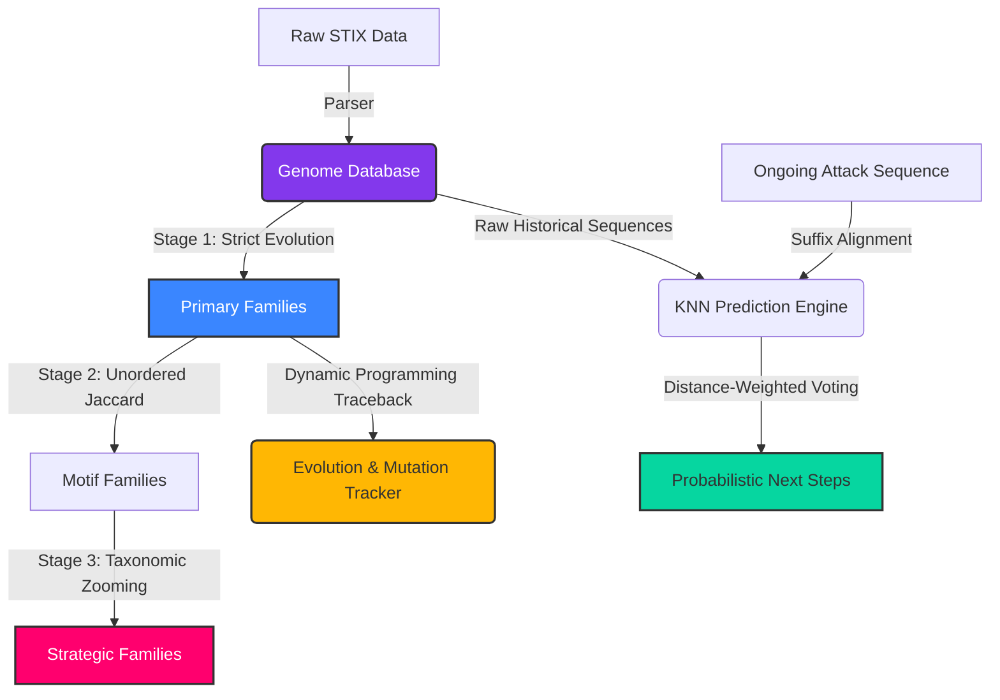

# CyberPhylogeny: A Bio-Inspired Framework for Reconstructing Evolutionary Relationships of Cyberattacks

[](https://www.python.org/downloads/)
[]()
[]()
[](https://opensource.org/licenses/MIT)

> **Research Concept:** Traditional Threat Intelligence (CTI) relies heavily on matching static Indicators of Compromise (IoCs). However, when attackers mutate their malware (e.g., swapping a persistence mechanism), static IoCs fail. **CyberPhylogeny** bridges the gap between Computational Biology and Cybersecurity by treating cyberattacks as biological organisms. By modeling attacks as sequences of behaviors (Genomes), this framework is capable of **reconstructing the evolutionary relationships** between attack variants.

## The Biological Mapping

CyberPhylogeny maps standard cybersecurity concepts into a biological ontology:

- **Gene:** A single atomic action in an attack. Modeled as a 3-tier hierarchy:
  - *Behavior* (e.g., Credential Theft)
  - *Implementation* (e.g., LSASS Memory)
  - *MITRE Technique* (e.g., T1003.001)
- **Genome:** The ordered sequence of Genes that makes up an entire cyberattack (e.g., APT29).
- **Evolutionary Family:** A cluster of Genomes that share a common ancestral structure, identified mathematically rather than by human-assigned labels.
- **Phylogenetic Tree:** A reconstructed branching tree showing exactly how a novel attack evolved from a known ancestor.

## Research Areas & Domains
This project sits at the intersection of computational biology, data science, and threat intelligence:
1. **Bioinformatics & Sequence Alignment**: Utilizing Global Levenshtein and Subsequence Alignment to calculate the structural distance between malware genomes.
2. **Unsupervised Machine Learning**: Deploying DBSCAN density-based clustering to automatically discover evolutionary families from raw behavioral data.
3. **Probabilistic Prediction**: Utilizing Distance-Weighted K-Nearest Neighbors (KNN) to mathematically predict the highest probability next-steps of an ongoing attack.

## Project Architecture (Multi-Stage Pipeline)



## Core Features

- **Multi-Stage Classification Pipeline**: Handles complex "Orphan" attacks by filtering them through three biological lenses (Strict Sequence, Jaccard Bag-of-Genes, and Tactic-level Zooming).
- **Probabilistic Prediction Engine**: Utilizes a **Distance-Weighted KNN with Sliding Window Alignment**. Instead of equal voting, it multiplies predictions by their mathematical suffix similarity, generating rigorous Confidence Multipliers to eliminate false positives.
- **Dynamic Evolution Traceback**: Maps exactly how and where an attack mutated from its evolutionary ancestor (identifying specific gene insertions, deletions, and substitutions).

## Technical Stack
- **Data Processing**: `numpy`, `scikit-learn`
- **Visualization**: `rich` (Terminal UI)
- **Database**: `SQLite3`
- **Threat Intelligence**: `MITRE ATT&CK STIX Framework`

## Installation & Usage

### Local Setup
1. **Clone the repository:**
   ```bash
   git clone https://github.com/rakesh-pathuri/CyberPhylogeny.git
   cd CyberPhylogeny
   ```
2. **Create a Virtual Environment:**
   ```bash
   python -m venv venv
   
   # Windows
   .\venv\Scripts\activate
   # macOS/Linux
   source venv/bin/activate
   ```
3. **Install Dependencies:**
   ```bash
   pip install rich scikit-learn numpy pydantic
   ```

### Command Line Interface & Examples

**1. Multi-Stage Clustering** 
Groups attacks into families based on structural similarity.
```bash
python main.py cluster --eps 0.6 --min_samples 2
```
*Example Output:*
```text
STAGE 1: Strict Evolutionary (Levenshtein) Families

Family 24 - 5 attacks
+------------------------------------------------+
| Attack /     |                 |               |
| Group ID     | Name            | Genome Length |
|--------------+-----------------+---------------|
| S0390        | SQLRat          | 8             |
| S0360        | BONDUPDATER     | 7             |
| G0133        | Nomadic Octopus | 7             |
| G0079        | DarkHydrus      | 7             |
| G0084        | Gallmaker       | 6             |
+------------------------------------------------+
```


**3. Phylogenetic Terminal Tree (NEW)** 
Prints a rich, branched evolutionary tree mapping precise mutations.
```bash
python main.py tree 24
```
*Example Output:*
```text
Phylogenetic Tree for Family 24 (2 variants)
Evolutionary Tree
├── Ancestor: S1135 (MultiLayer Wiper)
│   ├── execution: Scheduled Task
│   └── execution: Windows Command Shell
└── Descendant: S0697 (HermeticWiper) (Evolved from S1135)
    ├── execution: Scheduled Task
    ├── execution: Windows Command Shell
    ├── execution: Native API <-- New Gene
    ├── persistence: Windows Service <-- New Gene
    ├── stealth: Compression <-- Mutated (from Stored Data Manipulation)
    └── defense-impairment: Clear Windows Event Logs
```

**4. Predict Next Steps** 
Predicts the attacker's next move based on mathematical sequence alignment.
```bash
python main.py predict T1566.001,T1059.001
```
*Example Output:*
```text
Ongoing Attack Sequence: ['T1566.001', 'T1059.001']

Most Probable Next Behaviors:
+--------------------------------------------------------------------------------+
| Predicted Technique ID | Implementation        | Behavior  | Prob | Confidence |
|------------------------+-----------------------+-----------+------+------------|
| T1059.003              | Windows Command Shell | execution |  80% |      4.00x |
| T1059.007              | JavaScript            | execution |  20% |      1.00x |
+--------------------------------------------------------------------------------+
```

---
### Authorship & Contributions
**Author:** Rakesh Pathuri

*This engine was architected and built independently by Rakesh Pathuri inspired by biological sequence analysis and an attempt to adapt it for proactive cyber defense.*
